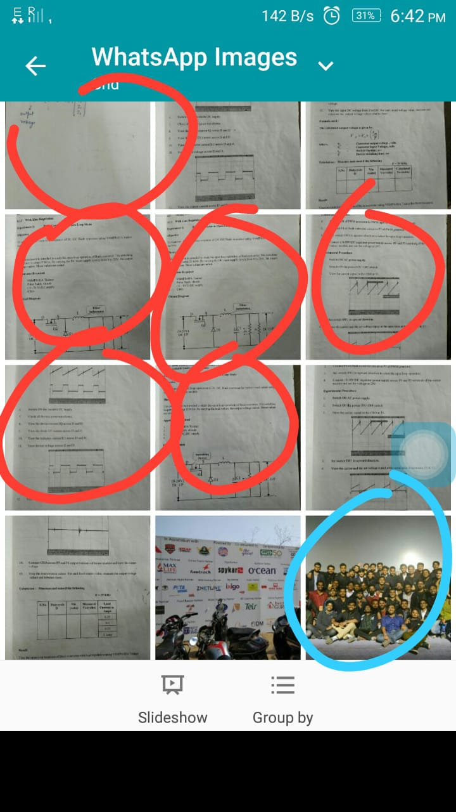

## Automate extraction of study notes from `WhatsApp Images`

We all end up with hell lot of _images to be deleted_ at the end of each semester. I've trained a CNN model to predict such images and extract them out of WhatsApp Images directory

Images dataset can be found on [Google Drive](https://drive.google.com/open?id=10MU3-qnDnSXWe4uoirBKsgd_lr9oxpLQ)

like this: 

Requirements:

* [Numpy](http://www.numpy.org/)
* [Keras](https://keras.io)
* [TendorFlow](https://www.tensorflow.org/)

Instructions:

* Download and extract the project folder.Open the terminal in the extracted folder and Install dependencies using `pip install -r requirements.txt`. 
* Connect your Smartphone to your system(Linux/Ubuntu OS), mount `Internal Storage` and copy the absolute path to the WhatsApp folder, to know the absolute path open a terminal in `WhatsApp` folder and run `pwd` command(in Linux OS) or copy the location by choosing properties from right-click menu (in Windows OS) . 
* Run the `extract.py` script by `python extract.py` and paste the copied path when asked to. The script will create a new folder named `notes` in your `WhatsApp Image` folder and move the study notes images to it.

We've trained the model on about 1000 images and using Keras' data augmentation pipeline. Currently the model is 92% accurate on my dataset. Feel free to add your own data and train the model on it to make the model more accurate. To add your own data, create a `data` folder in `behind_the_scenes` folder, create two subfolders `1` and `0` inside `data`, in `1` put study notes and put all other important images in `0`. See `behind_the_scenes` folder for more info.

